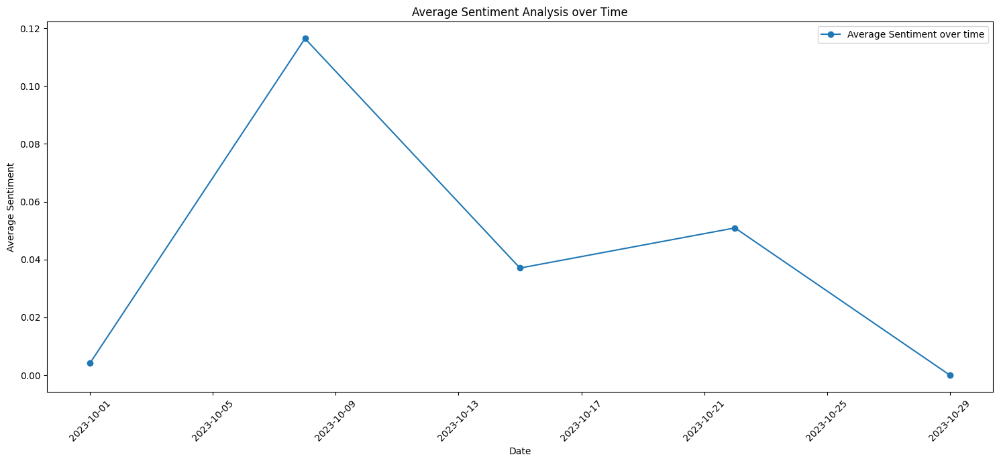

# Disney Sample Data Analysis

This document summarizes the analysis performed on the Disney sample dataset.

## Task 1: Language Usage

Languages used within the dataset are listed below with their respective counts:

    pl    4714
    en      36
    de       4
    sr       4
    fr       2
    cs       2
    sl       1
    hu       1
    es       1
    hr       1
    it       1
    eo       1
    zh       1

## Task 2: Country Reach

The total reach by country is sorted in descending order as follows:

    PL    8412642
    GB     701253
    US     647286
    MX     207559
    FR     180164
    CA     179450
    NL      13015

## Task 3: Efficiency by Source

The top 3 most efficient hosts based on the ratio of reach to host traffic are:

    toreadornottoread.pl        2251.559524
    wikingmovie.blogspot.com     853.769737
    disney-plus.softonic.pl      482.035320

## Task 4: Sentiment Analysis Over Time

A sentiment analysis was performed, and the results were plotted over time. The plot illustrates the average sentiment per week. The sentiment values are mapped as: `positive: 1, neutral: 0, negative: -1`.

Please refer to the chart below to visualize the average sentiment analysis over time:

